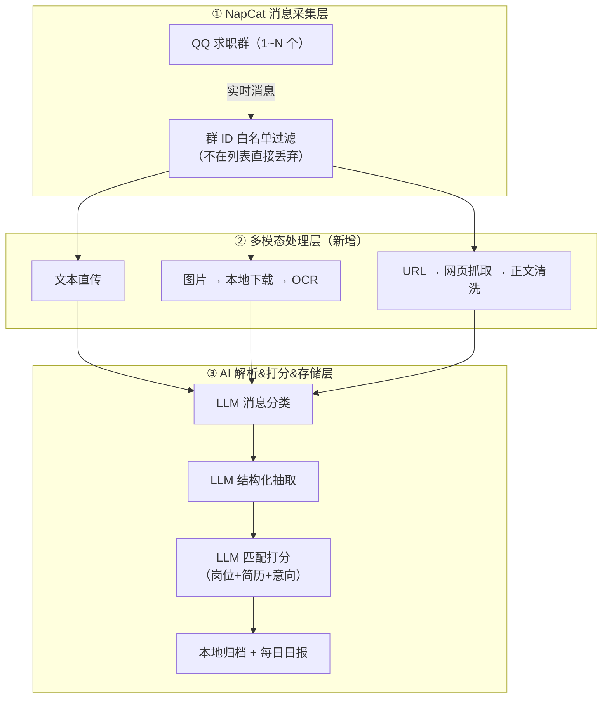
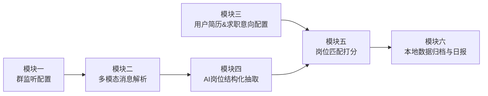
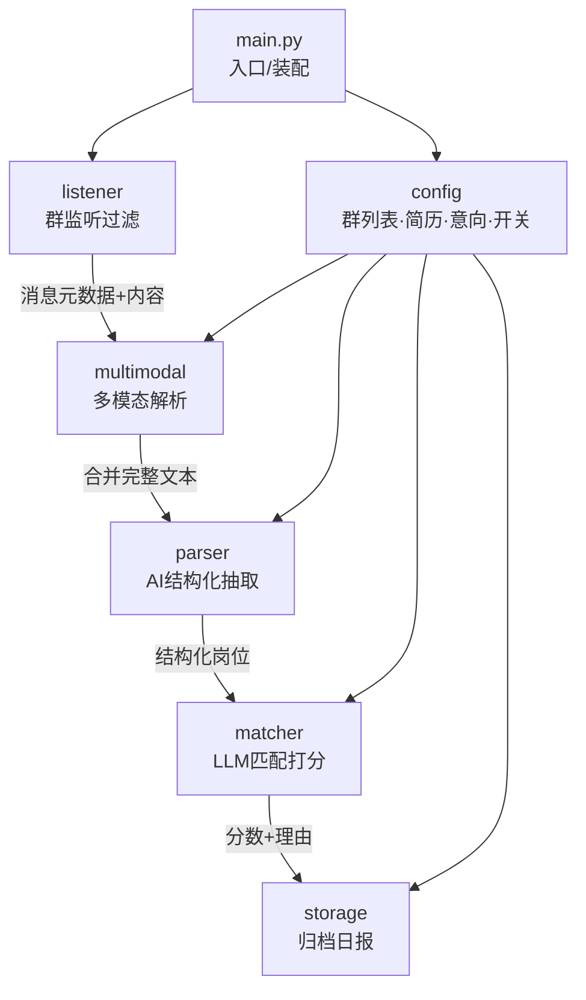
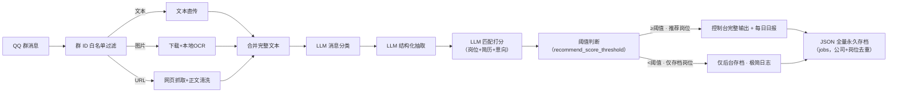

# ARCHITECTURE.md

# AI 求职信息智能筛选助手 · 架构文档

> 文档版本：v1.8（对齐产品方案 V1.9；落地模块六实现 + V2.0 查看侧 + 历史消息补拉 v0.6.4 + LLM 服务切换为 DeepSeek 官方 API 直连 v0.6.5 + 自动补全/自动去重/风评检索/Web 录入删除 v0.7.0）
> 更新日期：2026-09-20
> 依据文档：《docs/产品方案.md》V1.9
> 适用规范：根目录《rule.md》

---

## 一、业务需求概述

### 1.1 业务背景与痛点

面向应届秋招学生，求职信息分散在多个 QQ 求职群中，存在五大痛点：

| 痛点 | 业务影响 |
| --- | --- |
| 信息爆炸冗余 | 群消息量大，闲聊、广告混杂宣讲招聘信息，人工筛选耗时且易漏岗位 |
| 群动态变化 | 求职群随时增减，监听群不能写死固定群 ID |
| 信息载体多样 | 岗位信息分散在文本、图片海报、外部网页三种载体，人工处理繁琐 |
| 画像因人而异 | 每人简历背景、求职意向不同，筛选规则不能写死 |
| 信息无法沉淀 | 零散岗位信息无法自动归档，难以统一对比、复盘投递机会 |

### 1.2 功能需求清单（9 项）

| 编号 | 功能需求 | 关键约束 / 设计点 |
| --- | --- | --- |
| F1 | 监听群配置管理 | 支持 1~N 个群 ID；仅监听列表内群，不在列表直接丢弃；V1.0 改配置需重启生效 |
| F2 | 多模态消息采集 | 文本直传；图片本地下载 + 本地 OCR；URL 拉取网页正文；只读不发送 |
| F3 | 用户简历&求职意向配置 | 用户粘贴简历全文 + 填写意向（岗位/城市/行业/排除项），程序不预置标签 |
| F4 | AI 智能信息解析 | 消息分类（宣讲/招聘/内推/闲聊广告/诈骗）+ 结构化字段抽取 |
| F5 | 岗位匹配打分 | 岗位信息 + 简历 + 意向一并送 LLM，输出 0~100 分 + 简短理由 |
| F6 | 岗位推荐阈值过滤 | 可配置推荐分数阈值（默认 80）；所有岗位全量存档到 jobs；仅 ≥ 阈值岗位在控制台推荐输出与日报展示，低分岗位仅后台存档、极简日志 |
| F7 | 自动去重归档 | 公司+岗位双维度去重；原始素材与结构化数据分目录存储 |
| F8 | 每日汇总日报 | 当日新增推荐岗位（≥ 阈值）按分数降序，输出 Markdown 日报 |
| F9 | 启停控制 | 手动开启/关闭，间歇运行，规避长时间挂机风控 |

### 1.3 非功能需求

- **账号安全**：NapCat 纯只读模式，关闭所有发送接口；仅本地单机，禁止云服务器
- **稳定性**：网页抓取设超时与页面大小上限；OCR 资源可控；单条抓取失败标记异常、不阻断整体流程
- **可配置性**：监听群、简历文本、求职意向、OCR/网页抓取开关全部配置文件化，不改代码
- **数据隔离**：原始消息、OCR 结果、网页内容、岗位 JSON、日报分开目录存放

---

## 二、整体架构

三层架构：**NapCat 消息采集层 → 多模态处理层 → AI 解析&打分&存储层**，纯本地单机部署。



### 各层职责

| 层次 | 技术载体 | 核心职责 | 设计约束 |
| --- | --- | --- | --- |
| 消息采集层 | NapCat | 监听 QQ 消息，按群 ID 白名单过滤，输出消息元数据 + 内容 | 禁用全部发送接口；仅监听配置内群 |
| 多模态处理层 | 本地 OCR + HTTP 抓取 | 文本直传 / 图片 OCR / URL 正文抓取，合并为完整文本 | OCR、网页抓取均支持开关；超时、大小上限；失败标记异常不阻断 |
| AI 解析&打分&存储层 | LLM（DeepSeek 官方 OpenAI 兼容 API 直连，无中间网关） | 消息分类 → 结构化抽取 → 匹配打分 → 归档日报 | 字段缺失标【信息未提及】；打分输入含用户简历与意向；LLM 调用失败/输出非法单条标记、不阻断整体 |

---

## 三、模块划分与作用（基于业务讲解）

按 V1.4 产品方案，系统划分为 **6 个功能模块**，每个模块对应一项核心业务能力。

### 3.1 模块总览



### 3.2 各模块作用详解

#### 模块一：群监听配置模块

- **对应业务需求**：F1 监听群配置管理 + 非功能「账号安全」
- **业务作用**：数据链路的**入口闸门**，解决"求职群动态变化、不能写死群 ID"的痛点；同时是风控第一道防线
- **关键设计**：
  1. `monitor_group_ids = [123456, 789012]`，数组配置，支持 1~N 个群；空数组不监听
  2. 消息到达先校验群 ID，不在列表直接丢弃，不进入下游流程
  3. V1.0 修改配置后重启生效（不支持热加载，V2.0 支持）
  4. **事件类型兼容（v0.7.0）**：`filter_message` 放行 `post_type` 为 `"message"` 与 `"message_sent"` 两类——NapCat 对登录 QQ 自己发送的群消息/群内历史同步消息标记为 `message_sent`，若仅放行 `message` 会导致该群 0 条消息进入链路（实测某群全量 `message_sent`）；历史补拉 `history_to_message` 同步受益
  5. **历史消息补拉（v0.6.4）**：NapCat 正向 WS 只推实时事件、不补历史，休眠/重启期间消息整体错过；连接成功（含断线重连）后经 NapCat HTTP 扩展接口 `get_group_msg_history` 低频补拉最近 `backfill_count` 条（默认 50），按 `(群号, 消息ID)` 与 `raw_msg` 文件名去重后复用实时链路；仅拉取不发送、每次连接一次、单群失败 WARN、单条处理失败隔离（`job_assistant/listener/history_backfill.py`）

#### 模块二：多模态消息解析模块

- **对应业务需求**：F2 多模态消息采集
- **业务作用**：解决"招聘信息载体多样（文本/图片海报/外部网页）"的痛点，保证信息捕获完整性
- **关键设计**（3 条分支）：
  1. **文本分支**：直接透传下游
  2. **图片分支**：本地下载图片（文件名带消息前缀防覆盖）→ PaddleOCR 识别（设超时 `ocr_timeout`）→ OCR 结果附加到消息文本；识别失败/超时标记 OCR 异常
  3. **URL 分支**：模块二自行正则提取 http/https 链接（`extract_urls`）→ HTTP GET → HTML 清洗提取正文 → 附加到消息文本；受 `enable_web_fetch` 开关控制
  4. **控制策略**：超时、页面大小上限；**显式识别并跳过需登录、JS 强渲染页面**；单条失败标记异常、不阻断整体

#### 模块三：用户简历&求职意向配置模块

- **对应业务需求**：F3 用户简历&求职意向配置
- **业务作用**：解决"每个人简历背景、求职意向不同，筛选规则不能写死"的痛点，是**配置驱动设计的核心**
- **关键设计**：
  1. YAML 配置 `user_resume`（简历全文）与 `user_intention`（意向岗位/意向城市/硬性排除）
  2. 程序**不预置任何固定标签与权重**，直接把完整文本交给 LLM 作为打分依据
  3. 用户随时修改，最新简历与意向即时生效于后续打分

#### 模块四：AI 岗位结构化抽取模块

- **对应业务需求**：F4 AI 智能信息解析（结构化抽取部分）
- **业务作用**：把合并后的完整文本（原始消息 + OCR 文字 + 网页正文）转换为标准化岗位数据，供打分与归档使用
- **输出字段**：公司名称、岗位名称、工作地点、学历要求、技术栈要求、投递方式、截止时间、信息来源
- **容错设计**：字段允许为空，缺失字段标记【信息未提及】，不强行补全
- **实现要点（v0.4.0 落地）**：
  1. `MessageClassifier` 先做消息分类（宣讲/招聘/内推/闲聊广告/诈骗），闲聊广告/诈骗/其他**不进入抽取**，是第一道语义闸门
  2. `JobExtractor` 编排「分类 → 招聘相关才抽取 → ParseResult」；`HttpLLMClient` 走 DeepSeek 官方 OpenAI 兼容 `/chat/completions`（`https://api.deepseek.com/v1`，直连无中间网关），base_url/api_key/model/timeout 全部配置驱动（`llm` 段）
  3. LLM 输出格式非法（非 JSON）自动重试一次（`max_retries`）；**单条消息解析失败写入 `ParseResult.error`，不阻断整体流程**
  4. 岗位 JSON 字段（`JobPosting.to_dict`）一次性定义完整：8 业务字段 + category + group_id/message_id 溯源，兼容 V2.0 Web UI 读取

#### 模块五：岗位匹配打分模块

- **对应业务需求**：F5 岗位匹配打分 + F6 岗位推荐阈值过滤
- **业务作用**：替代人工对照简历逐条判断，实现个性化、动态的岗位匹配；并依据阈值划分推荐/仅存档，控制展示范围
- **关键设计**：
  1. 输入：结构化岗位信息 + `user_resume` + `user_intention`
  2. 由 LLM 对比两个维度：岗位要求与简历能力匹配度；岗位地点/类型与求职意向匹配度
  3. 输出：**0~100 匹配分数 + 简短打分理由**
  4. 与 V1.0 对比：取消固定权重（西安+30 等），改为 LLM 动态打分，完全由用户画像驱动
  5. **后置阈值过滤**：打分完成后读取配置 `recommend_score_threshold`（默认 80）：**分数 ≥ 阈值**标记为推荐岗位（控制台输出完整信息、写入日报）；**分数 < 阈值**标记为仅存档岗位（仅 JSON 存档、控制台极简日志）
- **实现要点（v0.5.0 落地）**：
  1. `JobScorer` 复用模块四的 `LLMClient` 做动态打分，输出 JSON `{score, reason}`；用户画像未配置时**前置校验跳过打分**（不调用 LLM，提示先填写简历/意向）
  2. 打分响应格式非法自动重试一次（`max_retries`）；**分数越界（<0 或 >100）容错截断**到 [0,100] 并记录 WARN，不视为失败；**单条岗位打分失败写入 `MatchResult.error`，不阻断整体流程**
  3. `rank_by_score` 按分数降序稳定排序，为模块六日报预置排序能力；失败项固定排末尾
  4. 阈值过滤在 `MatchResult.is_recommended`（≥ 阈值）完成，模块六存储将全量落盘、日报仅取推荐岗位
  5. **前置校验 + 联网搜索补全（v0.6.6 问题修复 1/4，问题4 为用户更正版）**：待复核岗位（工作地点疑似宣讲/招聘场地，值级关键词 + 原文上下文 ±20 字符双重识别）在打分前跳过 LLM 调用，标记 `review_required`；残缺岗位（缺公司名/岗位名）在打分前先走**联网搜索补全**——`enrich_missing_fields` 用已有字段 + 工作地点构造检索词 → 神马搜索（主源，JSON 结构化、反爬弱）+ 百度（兜底）→ LLM 依据搜索资料抽取缺失字段（不编造，输出「信息未提及」等变体归一化为【信息未提及】）→ 补全成功就地更新并清空残缺标记；搜索失败 / 无法确认才标记 `incomplete`，不纳入 ≥80 分推荐池
  6. **联网检索补全（v0.6.6 问题修复 5）**：打分前调用 `research_company(company, job_title)`（`research/company_research.py`）——Bing 网页搜索（员工风评/WLB/舆情，过滤官方站）+ 百度百科（业务/经营简介）双来源，结果经 `max_chars` 截断后并入打分提示词【公司外部检索资料】段；全部检索失败自动降级：打分理由标注「未自动联网核验，WLB 需人工自查」，该维度不计入自动打分，日报保留一键复制搜索关键词。检索能力属于业务插件层（公开网页抓取，无 API Key 依赖），与 LLM 网关无关
  7. **残缺补全全自动浏览器链路（v0.7.0）**：`enrich_missing_fields` 升级为多级兜底——① DeepSeek 生成检索词（失败回退规则词 + 追加 `site:edu.cn` 高校就业网专项 + 公告词）；② 多源搜索合并去重（Bing → 神马 → 百度，**全部检索词都执行**，修复早期命中即 break 导致 `site:edu.cn` 从不执行的问题）；③ 按详情页价值排序（edu.cn/zhiye 优先）→ HTTP 抓详情页；④ HTTP 失败降级 **Playwright 无头浏览器渲染**（`research/browser_fetch.py`：`browser_fetch_texts` 渲染抓正文 + `browser_fetch_links` 挖掘官网校招入口 campus/career/recruit/zhiye/job/jobs/join/talent）；⑤ 挖掘 zhiye（北森）校招页 → DeepSeek 抽取完整字段。实测：普渡机器人自动补出"后端开发工程师"（pudutech.zhiye.com/campus/jobs 渲染 1285 字生效）、纵维立方补出"深圳/本科硕士博士"；DeepSeek 幻觉 URL（pudurobotics.zhiye.com 404）经抓取校验后纠正
  8. **牛客员工评价风评检索（v0.7.0，WLB 判断依据）**：`research_company` 检索词多路化（`"{公司}" 怎么样/加班/工作体验/评价` + `site:nowcoder.com` + 小红书语境词）+ 多源搜索（Bing/神马/百度）；`_platform_of` 平台标记（牛客→nowcoder.com、小红书→xiaohongshu.com/xhslink.com）命中优先；牛客页 HTTP 抓正文，**搜索引擎不索引牛客内容时自动浏览器渲染 `nowcoder.com/search/all?query=公司名` 兜底**（面经/员工评价/offer 投票，`_NOWCODER_CACHE` 同公司缓存只查一次，上限 200 条）。实测普渡命中多篇真实牛客面经并入打分提示词；**小红书确认登录墙**（无头浏览器被"手机号登录"拦截，HTTP/浏览器均不可达，属平台限制，保留语境检索词尽力命中摘要）

#### 模块六：本地数据归档与日报模块

- **对应业务需求**：F7 自动去重归档 + F8 每日汇总日报
- **业务作用**：解决"信息无法沉淀"的痛点，形成可回溯求职台账，支撑投递复盘
- **关键设计**：
  1. 基于「公司名称 + 岗位名称」去重
  2. **存储规则**：所有识别到的岗位（无论分数高低），结构化 JSON 全量永久存入 `./data/jobs`；岗位 JSON 字段一次性定义完整，兼容后续 V2.0 Web UI 读取，后续不改底层存储格式
  3. **日报规则**：Markdown 日报只读取推荐岗位（≥ 阈值），按匹配分数降序排列，附带分数、打分理由、信息来源；低分岗位不写入日报
  4. **查看入口**：终端控制台实时输出 + 本地 Markdown 日报 + JSON 存档文件；V1.0 不开发 Web 前台 UI（V2.0 查看侧已于 v0.6.3 落地为 Web 控制台，见第七章版本记录）
  5. 历史数据可回溯，为 V2.0 投递台账、V3.0 竞争度评估预留数据基础
- **实现要点（v0.6.0 落地，v0.7.0 去重增强）**：
  1. `JobRepository` 基于「公司名称 + 岗位名称」去重，重复岗位保留首次记录；去重索引启动时扫描历史存档重建（重启后去重仍生效）；公司/岗位缺失（【信息未提及】）时无法可靠去重，直接归档不丢弃
  2. **去重归一化（v0.7.0）**：`normalize_company_name` 公司别名归一化表（华为半导体业务部/华为海思/海思→华为，普渡科技/普渡机器人→普渡，龙旗科技/龙旗→龙旗）+ 去公司后缀/集团/股份等冗余；`normalize_job_title` 去 J 编号/括号内容/【信息未提及】噪音；`_is_generic_recruitment` 泛校招（软件开发工程师/校招/秋招等）与半导体通用岗归入 `\x1fgeneric` 同公司只留一条
  3. **启动自动去重（v0.7.0）**：模块级 `dedupe_jobs(jobs_dir)`——按归一化键分组，每组保留最优（推荐优先 → 分数高 → 字段完整度 7 字段 → 文件名新），重复文件**移入 `data/jobs_dedup_backup_<时间戳>/` 备份不删除**；缺公司名/损坏文件不参与去重（不丢任何岗位信息）；`main.py` 启动钩子在 `recompute_recommended` 之前执行（实测启动日志"岗位自动去重完成: 扫描=36 重复组=0 保留=24"）
  4. **推荐标记全量重算（v0.7.0）**：模块级 `recompute_recommended(jobs_dir, threshold)`——全量扫描已存档 JSON，`recommended = (score >= threshold)` 与打分判定一致，threshold 字段同步更新，只改标记不改分数；触发点 ① Web 配置页保存阈值（`server.py save_config` 响应带 recalc 统计）；② 主程序启动钩子（实测"推荐标记全量重算完成: 扫描=36 更新=0 失败=0 阈值=50"）；幂等可重复
  5. 存储规则落地：所有打分成功的岗位（推荐 + 仅存档）全量 JSON 永久存入 `./data/jobs`；存档记录 = `JobPosting.to_dict()` 11 字段 + 打分字段（score / reason / threshold / recommended）+ 归档时间戳（recorded_at），**字段只增不减，兼容 V2.0 Web UI 读取，后续不改底层存储格式**
  6. 文件名 `{日期}_g{群号}_m{消息ID}_{公司}_{岗位}.json`：日期前缀支撑日报按「当日新增」聚合，群号/消息 ID 保留溯源；非法字符清洗避免路径歧义
  7. `DailyReport` 日报规则落地：只读取当日推荐岗位（按存档时 recommended 标记），按匹配分数降序稳定排序，附带分数、打分理由、信息来源；低分岗位不写入日报；空日报兜底落盘
  8. 日报生成时机：V1.0 手动启停，每次运行结束时生成（main 的 finally 中调用），同一日多次运行覆盖为最新日报；写入失败抛 `ReportError`（STO.REPORT.001），main 记录 ERROR 后降级退出，不影响当日已归档数据
  9. 单条岗位归档失败（`JobSaveError` STO.SAVE.001）由 `save_job` 捕获标记返回（不入档），**不阻断整体流程**

---

## 四、包结构与依赖关系

### 4.1 包结构设计

```
job_assistant/
├── main.py                    # 程序入口：启停控制、模块装配
├── config/                    # 全局配置（被下游模块依赖）
│   ├── settings.py            # 监听群列表、OCR/网页抓取开关、输出路径
│   └── profile.py             # 用户简历(user_resume)与求职意向(user_intention)
├── listener/                  # 模块一：群监听配置
│   ├── napcat_client.py       # NapCat 连接，只读接收消息（连接成功回调）
│   ├── group_filter.py        # 群 ID 白名单过滤（不在列表直接丢弃）
│   └── history_backfill.py    # 历史消息补拉：NapCat 扩展 API 低频拉取 + 去重（v0.6.4）
├── multimodal/                # 模块二：多模态消息解析
│   ├── text_branch.py         # 文本直传
│   ├── ocr_engine.py          # 图片下载 + PaddleOCR 识别（超时控制，失败标记异常）
│   ├── web_fetcher.py         # 链接提取 + 网页抓取 + HTML 清洗（超时/大小限制，登录/JS 页识别）
│   └── processor.py           # 三分支编排入口，输出合并完整文本 MultimodalResult
├── parser/                    # 模块四：AI 结构化抽取
│   ├── llm_client.py          # LLM 调用封装（DeepSeek 官方 OpenAI 兼容 HTTP，可注入测试替身）
│   ├── classifier.py          # 消息分类（宣讲/招聘/内推/闲聊广告/诈骗）
│   ├── extractor.py           # 编排入口：分类→抽取→ParseResult（单条失败不阻断）
│   └── schema.py              # 结构化岗位字段模型（缺失标【信息未提及】）+ 消息类别枚举
├── matcher/                   # 模块五：岗位匹配打分
│   ├── scorer.py              # LLM 打分：岗位+简历+意向 → 0~100 分+理由；阈值过滤（MatchResult）
│   └── ranking.py             # 按分数降序排序（稳定排序，日报用）
├── research/                  # 业务插件层（v0.6.6 起）：残缺补全 + 公司风评/WLB 检索
│   ├── company_research.py    # 检索词生成 / 多源搜索(Bing·神马·百度·360·搜狗) / 详情页抓取 / 牛客浏览器兜底 / LLM 字段抽取
│   └── browser_fetch.py       # Playwright 无头浏览器渲染（正文抓取 browser_fetch_texts + 校招入口挖掘 browser_fetch_links）
└── storage/                   # 模块六：归档与日报
    ├── repository.py          # 分目录 JSON/Markdown 持久化 + 去重归一化 + dedupe_jobs + recompute_recommended
    ├── report.py              # 每日日报生成
    └── data/                  # 数据目录（见第六章）
```

### 4.2 包依赖关系图

依赖原则：**上层依赖下层、单向流动**；`config` 为公共依赖，业务包不得反向依赖上层。



依赖说明：

| 依赖 | 原因 |
| --- | --- |
| `main → listener / config` | 入口装配监听模块并加载全局配置 |
| `listener → multimodal` | 通过白名单的消息必须经多模态处理（文本/OCR/网页） |
| `multimodal → parser` | 合并后的完整文本送入 LLM 做分类与抽取 |
| `parser → matcher` | 打分依赖结构化岗位字段 |
| `matcher → storage` | 归档打分排序后的有效岗位数据 |
| `config → multimodal/parser/matcher/storage` | 开关、简历意向、LLM 接入（llm 段）、输出路径全部配置驱动 |

---

## 五、核心业务流程图

### 5.1 端到端数据流



### 5.2 关键设计决策

| 决策点 | 方案 | 理由 |
| --- | --- | --- |
| 群监听范围 | 白名单群 ID 数组，不在列表直接丢弃 | 群动态变化，避免无关群消息进入处理链路 |
| 多载体信息捕获 | 文本 + 图片 OCR + URL 网页正文三条分支 | 招聘信息分散在三种载体，保证捕获完整 |
| 用户画像 | 用户粘贴简历 + 填写意向，程序不预置标签 | 画像因人而异，打分完全由用户输入驱动 |
| LLM 接入 | DeepSeek 官方 OpenAI 兼容 `/chat/completions`（`https://api.deepseek.com/v1`），base_url/api_key/model/timeout 配置驱动；`model` 留空用服务端默认 | 直连官方 API，无中间网关，调用去向可审计可验证；配置驱动无硬编码；api_key 仅入请求头、日志禁止打印 |
| 消息分类闸门 | LLM 先分类（宣讲/招聘/内推/闲聊广告/诈骗），非招聘相关不进入抽取 | 过滤闲聊广告，节省后续 LLM 调用与存储资源 |
| 结构化抽取容错 | 缺失字段标【信息未提及】；输出非 JSON 自动重试一次；单条失败标记不阻断 | LLM 输出不可控，容错优先，单条失败不影响当日流程 |
| 打分方式 | LLM 对比岗位/简历/意向，输出 0~100 分 + 理由 | 替代固定权重，个性化更强，可解释 |
| 打分容错 | 输出非 JSON 重试一次；分数越界截断到 [0,100]；画像未配置前置跳过；单条失败标记不阻断 | LLM 打分偶发偏差可自愈，画像缺失时不做无依据打分 |
| 推荐阈值过滤 | `recommend_score_threshold`（默认 80）：全量存档 + 展示层过滤（≥ 阈值才进推荐/日报） | 数据完整留存，展示聚焦高价值岗位 |
| 岗位去重 | 基于「公司名称 + 岗位名称」去重，重复保留首次记录；关键字段缺失不去重 | 避免同一岗位重复沉淀，台账可回溯；缺失关键信息时不误合并 |
| 去重增强（v0.7.0） | 公司别名归一化（华为半导体业务部/华为海思→华为）+ 岗位名归一化 + 泛校招同公司归并；启动自动清理，保留最优（推荐→分数→完整度→新），重复移入 `jobs_dedup_backup_` 备份 | 同一公司多条相似岗位/同公司不同表述不误判；去重不丢数据、可恢复 |
| 阈值重算（v0.7.0） | 修改 `recommend_score_threshold` 后全量重算已存档岗位：`recommended = (score >= threshold)`，只改标记不改分数 | 用户诉求"改一次阈值重新比对全部岗位"；Web 保存与启动双触发，幂等 |
| 手动删除（v0.7.0） | Web `DELETE /api/jobs?file=`：文件名 basename 白名单 + `.json` 校验（防路径穿越），删除 = 移入 `jobs_deleted_backup_` 备份 | 用户诉求"投完的岗位删掉"；不物理删除、可恢复，与自动去重同一备份策略 |
| 残缺补全（v0.7.0） | 多级兜底：LLM 检索词 → 多源搜索（全词执行）→ HTTP 详情页 → Playwright 渲染 → 校招页挖掘 → LLM 抽取；失败保持残缺不编造 | 用户诉求"只有公司名的岗位自动补全"；HTTP/渲染双通道，缺一降级 |
| 风评检索（v0.7.0） | 多路检索词 + 平台标记（牛客/小红书）+ 牛客 HTTP/浏览器渲染兜底（同公司缓存） | 用户诉求"WLB 依据员工风评（牛客网/小红书）"；小红书登录墙降级说明 |
| 日报口径 | 只读当日新增推荐岗位（存档 recommended 标记），分数降序；运行结束时生成覆盖 | 历史岗位不重复进当日日报；与当日控制台推荐展示保持一致 |
| 故障隔离 | OCR/抓取失败标记异常，不阻断整体流程 | 单条失败不影响当日汇总 |
| 历史补拉（v0.6.4） | 连接成功后经 NapCat HTTP 扩展接口低频拉取最近群消息（每群默认 50 条、开关可配），按 `(群号, 消息ID)` 去重后走实时链路；仅拉取不发送、单群失败 WARN、单条处理失败隔离 | 正向 WS 不补历史，电脑休眠 / 程序重启期间消息会整体错过；补拉覆盖该空窗且不重复消耗 LLM |
| 数据隔离 | 原始素材与结构化数据分目录存储 | 便于回溯、复盘、扩展 |

---

## 六、数据存储设计

```
./data
├── /raw_msg        # 原始消息文本
├── /image_raw      # 下载的图片原始素材（OCR 输入）
├── /ocr_result     # 图片 OCR 识别结果
├── /web_content    # 抓取网页正文
├── /jobs           # 结构化岗位 JSON（含分数与理由）
├── /report         # Markdown 每日日报
├── /logs           # 运行日志（main.log / main_err.log / web.log / web_err.log，启动脚本重定向）
├── jobs_backup_*/         # 存量岗位快照（手工清理前备份，如 jobs_backup_20260920_023626）
├── jobs_dedup_backup_*/   # 自动去重移动的重复岗位（v0.7.0，保留最优、重复不删除）
├── jobs_deleted_backup_*/ # Web 手动删除的岗位（v0.7.0，投完归档、可恢复）
└── logs_archive_*/        # 历史运行日志归档（v0.7.0，早期根目录日志归位）
```

| 目录 | 内容 | 更新策略 |
| --- | --- | --- |
| `raw_msg` | 原始消息文本 | 实时增量写入 |
| `image_raw` | 下载的图片原始素材（OCR 输入） | 实时增量写入 |
| `ocr_result` | 图片 OCR 识别结果 | 实时增量写入 |
| `web_content` | 抓取网页正文 | 实时增量写入 |
| `jobs` | 结构化岗位 JSON（含匹配分数、理由、来源） | **全量永久存档**（所有岗位无论分数高低；公司+岗位去重后写入） |
| `report` | Markdown 日报（按分数降序） | 每日定时生成，**仅含推荐岗位（≥ 阈值）** |
| `logs` | 主程序/Web 运行日志（stdout/stderr 重定向） | 启动脚本 `tools/scripts/start_all.ps1` 实时写入 |
| `jobs_backup_*` | 手工/脚本备份的岗位快照 | 存量清理前人工触发 |
| `jobs_dedup_backup_*` | 自动去重移动的重复岗位 | 启动自动去重 / `_dedupe_jobs.py` 手工清理时（v0.7.0） |
| `jobs_deleted_backup_*` | Web 手动删除的岗位 | Web 面板删除时（v0.7.0，文件名 basename 白名单 + `.json` 后缀校验防路径穿越） |
| `logs_archive_*` | 历史运行日志归档 | 2026-09-20 整理：run.log / run.err.log / web.log / web.err.log |

**存储格式约定**：岗位结构化 JSON 字段一次性定义完整，字段结构兼容后续 V2.0 Web UI 读取需求；后续新增 UI 模块时直接复用现有存储结构，**无需修改底层存储格式**。存档记录 = `JobPosting.to_dict()` 的 11 个字段（8 业务字段 + category + 群号/消息 ID 溯源）+ 模块五打分字段（score / reason / threshold / recommended）+ 归档时间戳（recorded_at），字段只增不减。岗位文件名以「YYYY-MM-DD_」日期前缀开头，日报按文件名日期前缀聚合「当日新增」岗位。

---

## 七、风控与安全设计

1. **只读约束**：NapCat 禁用所有消息发送接口、关闭自动回复，纯消息接收
2. **运行策略**：本地单机、禁止云服务器、不全天挂机；间歇启停；触发人脸核验立即关停
3. **抓取安全**：网页抓取设超时与页面大小上限；不处理需登录、JS 强渲染页面；支持开关关闭
4. **数据安全**：全部数据本地留存，不上传第三方服务器

---

## 八、后续演进（与产品方案迭代规划对齐）

| 版本 | 架构演进点 |
| --- | --- |
| V1.0（当前） | 本架构落地：多群监听 + 多模态采集 + LLM 抽取打分 + 阈值过滤 + 全量归档 + 日报；查看入口 = 终端控制台 + 本地 Markdown 日报 + JSON 存档；**不开发 Web 前台 UI**。**增强（v0.6.4）**：历史消息补拉——NapCat HTTP 扩展接口 `get_group_msg_history` 低频补拉最近群消息（默认每群 50 条、开关可配、按消息 ID 去重），覆盖电脑休眠 / 程序重启期间错过的招聘消息。**增强（v0.6.6，问题修复 1/2/3/4/5）**：宣讲场地与工作地点字段区分校验（值级+上下文）、前端交互全量接线（日志等级筛选 / 日报岗位明细展开 / 配置在线保存）、OCR 依赖落地 paddleocr 2.7.3、残缺岗位联网搜索自动补全（神马+百度，LLM 抽取不编造，失败保持残缺）、打分前联网检索公司风评/WLB 补全（Bing+百科，失败自动降级）。**增强（v0.7.0）**：残缺补全升级为全自动浏览器链路（DeepSeek 检索词 → 多源搜索 → HTTP → Playwright 渲染 → 校招页挖掘 → LLM 抽取，普渡/纵维立方实测通过）；牛客员工评价浏览器风评检索（同公司缓存）；岗位自动去重（公司/岗位归一化 + 启动钩子 + 备份）；推荐阈值修改全量重算（Web 保存/启动双触发）；Web 手动录入（POST /api/jobs）与手动删除（DELETE /api/jobs，移入备份可恢复）；`message_sent` 事件类型兼容；`web_max_bytes` 上调至 4MB |
| V2.0 | **同一项目内追加开发**（不新建项目，前提 V1.0 全链路稳定）：Web 前台 UI（配置表单 / 实时日志 / 岗位列表 / 日报预览 4 个子页面，复用 V1.0 全部后端逻辑、文件存储、配置与 LLM 能力）；配置热加载（免重启）；关键词预警；投递台账；打分模式切换（LLM 自由 / 用户权重）。**状态（v0.6.3 ~ v0.7.0）：查看侧 + 录入/删除已落地**——`job_assistant/web/`（Python 标准库 http.server，零依赖）实现岗位看板（统计/分布图/搜索筛选/详情/**手动录入/手动删除**）/ 日报预览 / 实时日志 / 状态与配置（**配置在线保存 + 阈值全量重算**）；配置表单热加载、投递台账、打分模式切换待后续 |
| V3.0 | 简历自动精简优化 LLM 上下文；Playwright 支持 JS 渲染页（v0.7.0 已在残缺补全链路落地） |
